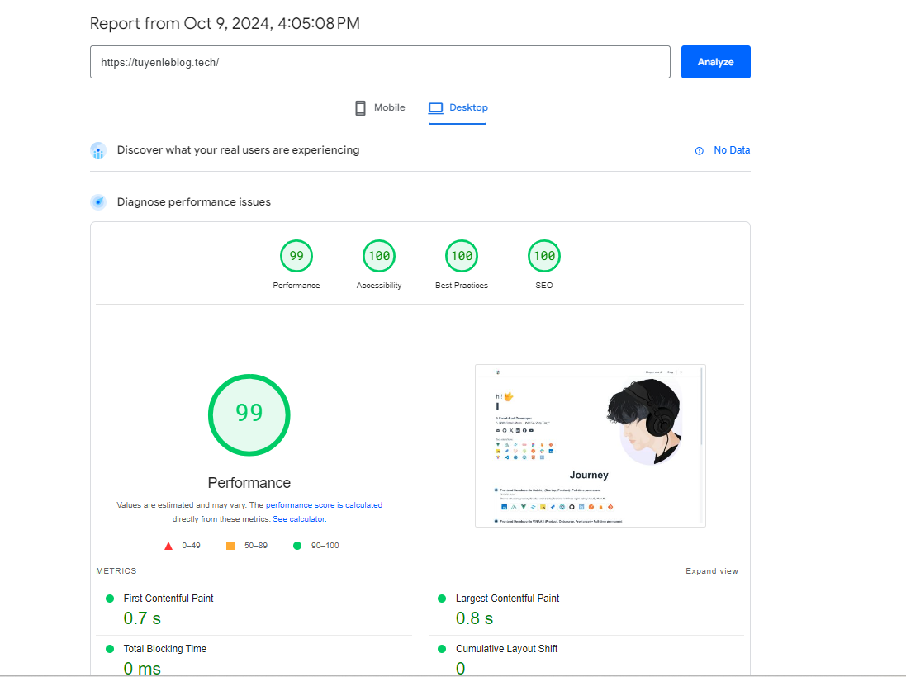
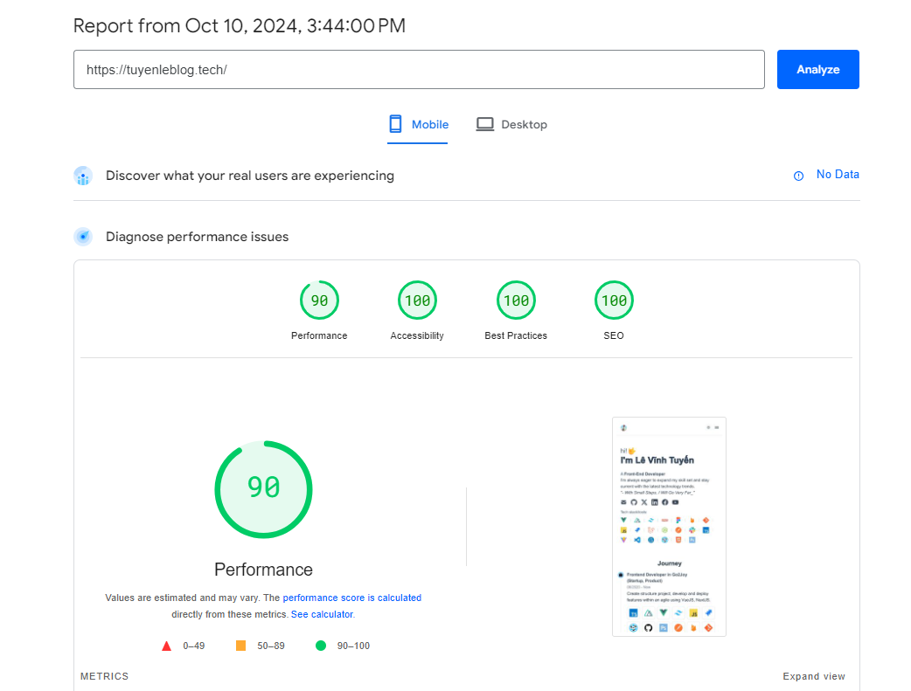

# Structure Nuxt 3 Awesome Starter

- 👀&nbsp; [Structure: Use Nuxt 3 Awesome Starter V2](https://githubblitz.com/viandwi24/nuxt3-awesome-starter)
- 👀&nbsp; [Link demo](https://tuyenleblog.tech/)
- 👀&nbsp; [Create avatar 3D](https://avaturn.me/)
- 👀&nbsp; [Source](https://github.com/levinhtuyen/portfolio-developer-and-blog)

## Preview


## Performance




## Features

- [x] 📚 [Nuxt Layer Support](https://nuxt.com/docs/getting-started/layers#layers)
- [x] 💨 [Tailwind CSS v3](https://tailwindcss.com/)
- [x] ✨ [Headless UI](https://headlessui.dev/)
- [x] 🔔 [Nuxt Icon](https://icones.js.org/)
- [x] 🛹 [State & Store Management (Pinia)](https://pinia.vuejs.org/)
- [x] 📦 [Vue Composition Collection (Vueuse)](https://vueuse.org/)
- [x] 🪝 Built-in Awesome Component & Layout
- [x] 🌙 [Theme Manager (Color Mode)](https://color-mode.nuxtjs.org/)
- [x] Configurable Theme (Easy to change)
  - [x] Primary Colors
  - [x] Font

## Getting Started

#### Using with Direct Clone

- clone this repository
  ```bash
  git clone https://github.com/levinhtuyen/myblog
  ```
- install dependencies
  ```bash
  yarn install
  ```
- run development server
  ```bash
  yarn dev
  ```
- run build server
  ```bash
  yarn build
  ```
